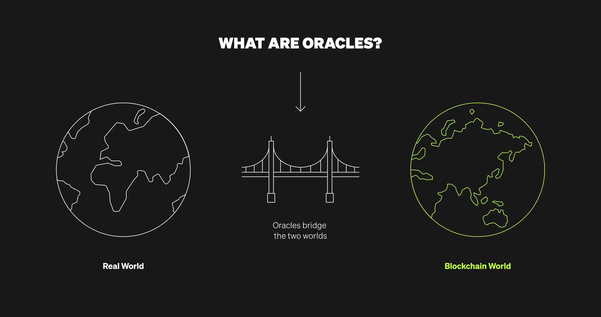
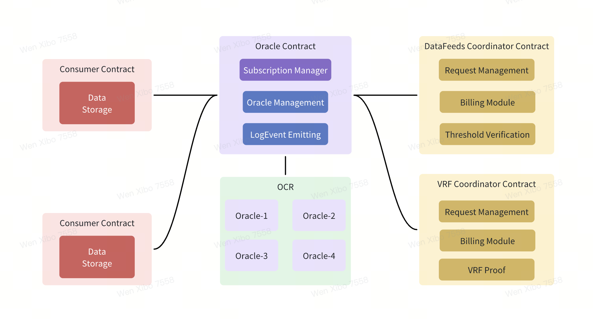

# AetherLink

## 1. Introduction

A web3 oracle is essential for decentralized networks, enabling smart contracts to access real-world data like weather 
updates or market prices. However, the security of oracles is a concern, as malicious actions can compromise contract 
execution. Choosing reliable oracle services is crucial in web3 development. Moreover, oracles not only link blockchains 
to real-world data but also enable the retrieval of information from other blockchain networks.



## 2. AElf Oracle Services - AetherLink

Among the various products in AElf, some products may require information from other chains. For example, the [eBridge](https://ebridge.exchange/) 
product needs to access lock-up information of NFTs on the Ethereum chain. This necessitates the use of oracle services 
for data interchange. To expand the AElf ecosystem and enhance user services, it is essential to establish the 
foundational services for oracle mechanisms.

In this context, AetherLink, AElf's proprietary oracle service, has been developed. AetherLink primarily focuses on 
providing Verified Random Function (VRF) capabilities and Data Feeds functionality.

## 3. What can AetherLink do?

### A. Random number generator

Generating random numbers directly on the blockchain is a complex and challenging problem. Due to the deterministic 
nature of blockchain, the results of smart contract executions must be consistent across all nodes in the network. 
Therefore, random number generation in smart contracts needs to be verifiable and replicable, ensuring that each node 
obtains the same result when executing the same smart contract.

However, traditional pseudo-random number generation methods, such as using block hashes, face challenges in this 
environment. If block hashes are used, each node in the smart contract would generate the same random number using 
identical inputs, making it impossible to achieve true randomness.

AetherLink VRF introduces the concept of Verifiable Random Function (VRF), employing algorithms designed by 
cryptographic experts to ensure that the generated random numbers on-chain are verifiable and unpredictable. AetherLink 
VRF provides a secure, decentralized, and verifiable mechanism for generating random numbers in smart contracts, 
delivering high-quality randomness without compromising security and usability.

The key advantages of using AetherLink VRF include:

#### 1. Verifiability: 
Cryptographic proofs are used to demonstrate the authenticity of the random number generation process, allowing smart 
contracts and users to verify the legitimacy of the generated random numbers.

#### 2. Unpredictability: 
Utilizing VRF algorithms ensures that random numbers generated by AetherLink VRF are unpredictable, even under identical
input conditions.

#### 3. Decentralization: 
AetherLink VRF operates across multiple nodes, enhancing the decentralization of random number generation and mitigating
risks associated with a single point of control.

Random number generator code segment:

```csharp
{
    var random = State.ConsensusContract.GetRandomHash.Call(new Int64Value
    {
        Value = specificData.BlockNumber
    });
    
    var alpha = HashHelper.ConcatAndCompute(random, specificData.PreSeed);
    
    Context.ECVrfVerify(publicKey, alpha.ToByteArray(), report.Result.ToByteArray(), out var beta);
    Assert(beta != null && beta.Length > 0, "Vrf verification fail.");
    
    var randomHash = Hash.LoadFromByteArray(beta);
    
    for (var i = 0; i < specificData.NumWords; i++)
    {
        response.Data.Add(HashHelper.ConcatAndCompute(randomHash, HashHelper.ComputeFrom(i)));
    }
    
    return response;
}
```

The process involves obtaining a random hash from the consensus contract, verifying it through ECVRF with a public key 
and an oracle-reported result, and then creating a set of random words based on the verified data. 

### B. DataFeeds

AetherLink Data Feeds Coordinator provides a quick and reliable connection for smart contracts to real-world data, 
encompassing data types like asset prices, reserve balances, NFT floor prices, and L2 sequencer health.

Data feeds from the Coordinator include Price Feeds, Proof of Reserve Feeds, NFT Floor Price Feeds, Rate and Volatility 
Feeds, and L2 sequencer uptime feeds. For example, Price Feeds are crucial for real-time actions in applications like 
decentralized finance (DeFi) platforms. These feeds aggregate data from multiple sources, ensuring reliability through 
the Decentralized Data Model and Offchain Reporting.

Components of a data feed involve the Consumer (onchain or offchain applications using Data Feeds), Coordinator contract
(onchain coordinator pointing to the oracle), and Oracle contract (receiving periodic data updates from the oracle 
network and storing aggregated data onchain).

Different data feeds cater to specific use cases, such as Proof of Reserve Feeds indicating the status of reserves, NFT 
Floor Price Feeds providing the lowest NFT prices, and Rate and Volatility Feeds offering interest rate curve data. L2 
sequencer uptime feeds track the last known status of the sequencer on Layer 2 networks.

## 4. AetherLink Contracts

To achieve these functionalities, AElf has deployed 3 main contracts. Their names and their functionalities are:

| Contract Type     | Functions and Responsibilities                        |
|-------------------|-------------------------------------------------------|
| Consumer Contract  | 1. Task initiation and receipt of results             |
|                   | 2. Result inquiry                                     |
| Coordinate Contract| 1. Task management                                    |
|                   | 2. VRF Proof verification and random number generation|
|                   | 3. Threshold signature verification                   |
| Oracle Contract    | 1. Node management                                    |
|                   | 2. Task event publication                            |

### A. Consumer Contract

A contract deployed by the user, for which the official interface proto file is provided by the platform for task 
initiation and result retrieval. Users are required to reference and implement this interface. The main functionalities 
include:

#### a. Task initiation:

Initiated by the user, subsequently invoking the Oracle contract to carry out subsequent operations.

#### b. Result retrieval:

Callback function executed by the Oracle contract, writing the results back to the user contract. Users are responsible 
for implementing the logic for data storage.

### B. Coordinator Contract

A contract provided by the platform. Based on the current products, PriceFeeds and VRF, two corresponding Coordinator 
contracts need to be deployed. The main functionalities include:

#### a. Task management:

Generates a unique 1D for tasks along with task details, storing them in the contract.

#### b. Threshold signature verification (for non-algorithmic verification thresholds) / VRF Proof verification:

After nodes submit task results, if it's a PriceFeeds-type task, the Coordinator contract is responsible for verifying 
the submitted signatures through threshold signature verification. If it's a VRF-type task, the Coordinator contract 
needs to reconstruct the random hash from the submitted proof.

### C. Oracle Contract

The official contract provided decouples Oracle nodes and Consumer contracts from business logic. It has three main 
functionalities:

#### a. Subscription Feature:

Provides subscription management functionality for user contracts, enabling task initiation through subscriptions.

#### b. Node Management Feature:

Implements the registration and role assignment of Oracle nodes, with configurable parameters for threshold signature.

#### c. Event-Driven Feature:

Oracle nodes need to listen to events from this contract, triggering corresponding operations when events are emitted.

The whole project structure:

