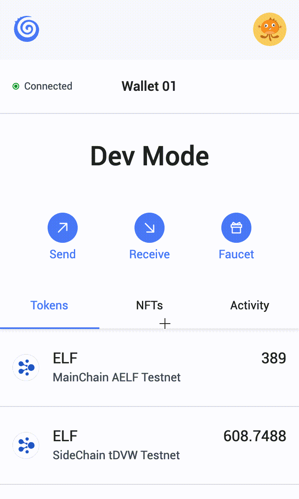
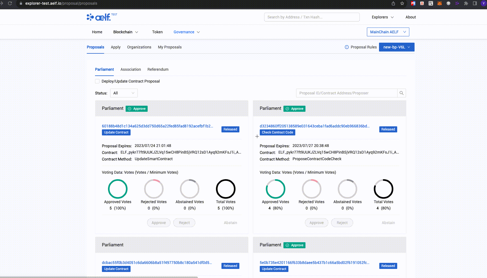

# Contract deployment on AElf explorer

## 1. Introduction

AElf empowers users to seamlessly deploy smart contracts onto the AElf blockchain using the AElf Explorer. This 
user-friendly platform allows individuals to deploy contracts directly onto the main chain or side chains through the 
Explorer interface. With the AElf Explorer, users can efficiently interact with and deploy smart contracts, contributing 
to a more accessible and streamlined blockchain development experience on the AElf ecosystem

## 2. AElf explorer address

### Test env:
- Mainchain: https://explorer-test.aelf.io/
- Sidechain: https://explorer-test-side02.aelf.io/
### Live env:
- Mainchain: https://explorer.aelf.io/
- Sidechain: https://tdvv-explorer.aelf.io/

## 3. Deployment on testnet sidechain

AElf provides users with the flexibility to deploy smart contracts directly onto the sidechain of the test environment 
without the need for explicit approval. This feature streamlines the development process, allowing developers to 
conveniently test their contracts on-chain. The following content will guide users on the specific steps to deploy 
contracts in this hassle-free manner.

### 3.1 Implement acs12.proto

Before deploying a contract to any AElf chain, it is essential to ensure that the contract has implemented ACS12. ACS12 
is a standard AElf package designed to display gas fees to users. The acs12.proto file is a prerequisite for deployment 
on the AElf chains.

```protobuf title="acs12.proto" showLineNumbers
/**
 * AElf Standards ACS12(User Contract Standard)
 *
 * Used to manage user contract.
 */
syntax = "proto3";

package acs12;

import public "aelf/options.proto";
import public "google/protobuf/empty.proto";
import public "google/protobuf/wrappers.proto";
import "aelf/core.proto";

option (aelf.identity) = "acs12";
option csharp_namespace = "AElf.Standards.ACS12";

service UserContract{
    
}

//Specified method fee for user contract.
message UserContractMethodFees {
  // List of fees to be charged.
  repeated UserContractMethodFee fees = 2;
  // Optional based on the implementation of SetConfiguration method.
  bool is_size_fee_free = 3;
}

message UserContractMethodFee {
  // The token symbol of the method fee.
  string symbol = 1;
  // The amount of fees to be charged.
  int64 basic_fee = 2;
}
```
Users must ensure that they have implemented ACS12 in their smart contracts; otherwise, the deployment of the smart 
contract will fail. Users can reference ACS12 in the following way and implement it into their smart contracts.

Here is how `HelloWorld_Contract.proto` implements ACS12:

```protobuf title="HelloWorld_Contract.proto" showLineNumbers
syntax = "proto3";

import "aelf/core.proto";
import "aelf/options.proto";
import "google/protobuf/empty.proto";
import "google/protobuf/wrappers.proto";
import "Protobuf/reference/acs12.proto";
// The namespace of this class
option csharp_namespace = "AElf.Contracts.HelloWorld";

service HelloWorld {
  // The name of the state class the smart contract is going to use to access blockchain state
  option (aelf.csharp_state) = "AElf.Contracts.HelloWorld.HelloWorldState";
  option (aelf.base) = "Protobuf/reference/acs12.proto";
  // Actions (methods that modify contract state)
  // Stores the value in contract state
  rpc MyMethod (google.protobuf.Empty) returns (google.protobuf.Empty) {
  }
}

```

Then build it again.

```bash copy
dotnet build
```

### 3.2 Get test tokens for deployment

Go to https://explorer-test-side02.aelf.io/proposal/proposals and login portkey account, and transfer some tokens to 
sidechain as the smart contract will be deployed on sidechain.

If you haven't don't have test tokens on your account, you may go to https://testnet-faucet.aelf.io/ to get some free 
test tokens.

Here is how to transfer test tokens to a side chain:


### 3.3 Submit a proposal

Go to https://explorer-test-side02.aelf.io/proposal/proposals , and click "Apply" (if apply button can not be found, please 
login first), and select "Deploy/Update Contract", upload the `/<your_contract_name>.dll.patched` file in project folder

```bash copy
<your_project>/src/bin/Debug/net6.0
```

### 3.4 Deploy the contract

After uploading your contarct file, click "Apply" at bottom then click "OK" in pop-up window, it will do code check and 
deployment automatically.

Please do not close the pop-up window until it's done, the address will be shown in pop-up window.

### 3.5 The whole process demo

Here is a gif of the whole deployment process. 

