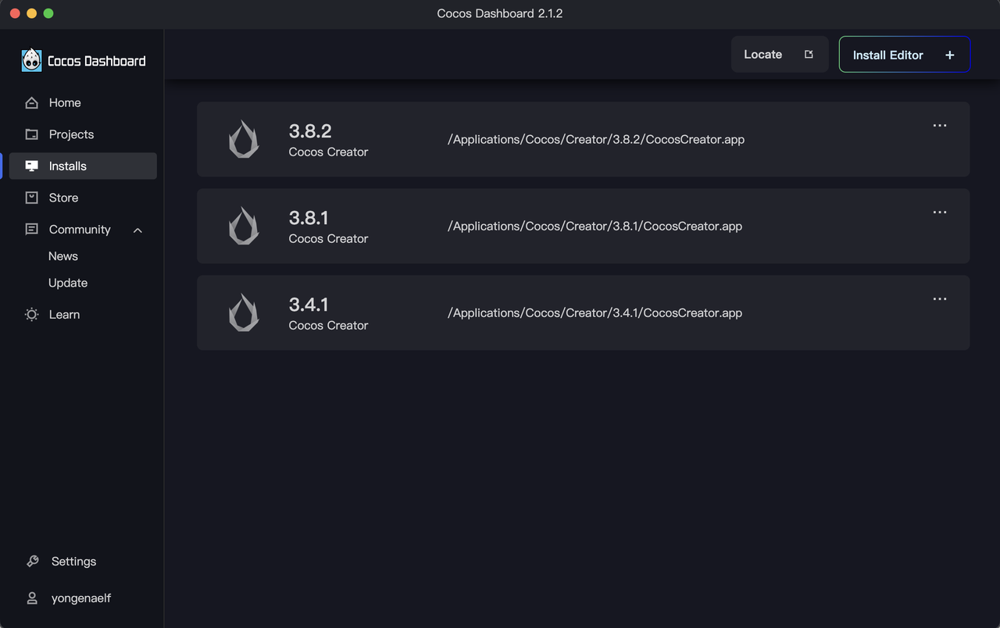
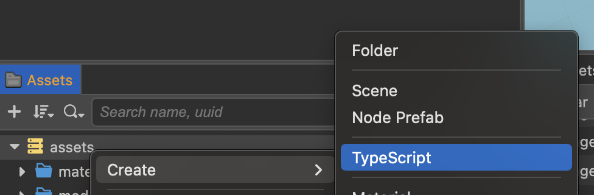
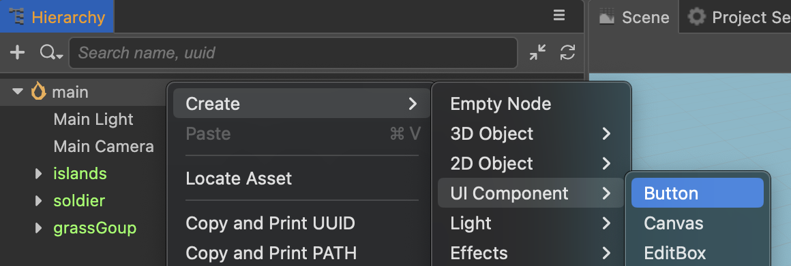
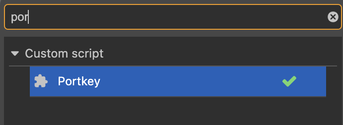
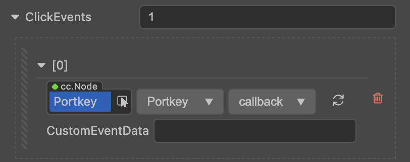

# Cocos

The following guide demonstrates how to integrate [Portkey Provider](https://doc.portkey.finance/docs/QuickStartGuides/PortkeyWalletProviderGuides/InstallAndInitialize) with [Cocos](https://www.cocos.com/en).

## Pre-requisites

- [Cocos Dashboard](https://www.cocos.com/en/creator-download).
- Cocos Creator (install it using Cocos Dashboard) - tested with v3.4.1
- [Nodejs](https://nodejs.org/en/download/current) (for installing portkey-provider)
- IDE (e.g. [VS Code](https://code.visualstudio.com/)) for editing code
- [Portkey Chrome extension](https://portkey.finance/download)

## Install Cocos Creator

Open Cocos Dashboard (create and login an account), click on the Installs tab, and install the version you need:



## Create new project or open existing project

Under the Projects tab, click on an existing project to open it, or New Project to create a new Project:

## Add script

Once you have the project opened, right click on the assets folder and add a script:



Name it as **portkey**.

Double-click on it to open in VS Code.

## Install @portkey/detect-provider

Open a Terminal in VS Code.

```bash
npm i --save @portkey/detect-provider
```

Edit the component file

```ts title="assets/portkey.ts"
import { _decorator, Component, Event, Node, Button, EventHandler } from "cc";
import detectProvider from "@portkey/detect-provider";
import { IPortkeyProvider } from "@portkey/provider-types";
const { ccclass, property } = _decorator;

@ccclass("Portkey")
export class Portkey extends Component {
  // https://docs.cocos.com/creator/3.4/manual/en/ui-system/components/editor/button.html#add-a-callback-using-the-script
  protected onLoad(): void {
    const clickEventHandler = new EventHandler();
    // This node is the node to which your event handler code component belongs
    clickEventHandler.target = this.node;
    // This is the script class name
    clickEventHandler.component = "Portkey";
    clickEventHandler.handler = "callback";
    clickEventHandler.customEventData = "foobar";

    const button = this.node.getComponent(Button);
    button.clickEvents.push(clickEventHandler);
  }

  callback(event: Event, customEventData: string) {
    // The event here is a Touch object, and you can get the send node of the event by event.target
    const node = event.target as Node;
    const button = node.getComponent(Button);
    console.log(customEventData); // foobar

    detectProvider()
      .then((provider: IPortkeyProvider) => {
        // do something with provider
        provider.request({ method: "requestAccounts" });
      })
      .catch((error: Error) => {
        // Handle error
      });
  }
}
```

## Add a new Button

In the Hierarchy panel, right click on main, go to **Create** > **UI Component** > **Button**.



Name it **Portkey**.

## Add script component

In the Inspector, click **Add Component**, and search for **portkey** under **Custom script**:



## Add click event

In the Inspector, increase ClickEvents to **1**, then choose **Portkey**, **Portkey**, **callback**:



## Preview project in Chrome

Under the Project menu, click Build, then Run.

Click on the button. If the Portkey Chrome Extension is installed, it will be opened.
